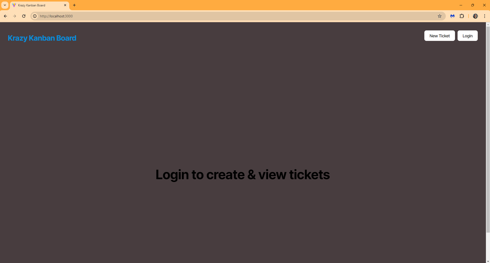
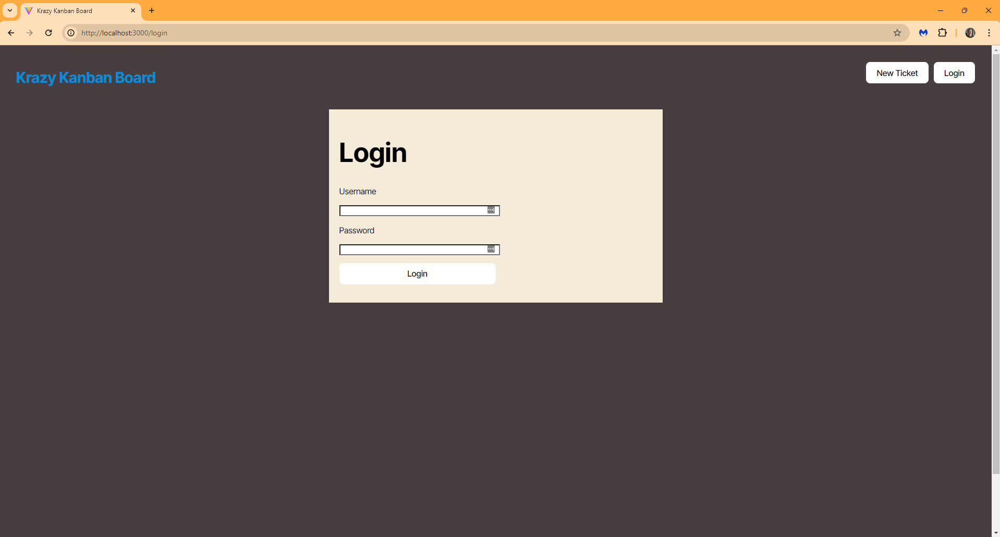
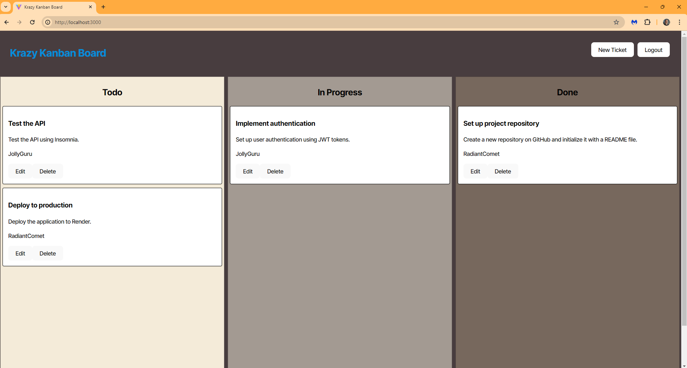

# 14 Full-Stack React: Kanban Board

## Your Task

Authentication with JSON Web Tokens (JWTs) is crucial for full-stack applications, as it provides a secure and scalable method for verifying user identities. JWTs are compact, URL-safe tokens that encode a user's authentication data, allowing servers to authenticate requests. Additionally, JWTs can include metadata and be easily verified and decoded, enhancing security while enabling seamless authentication across various parts of an application.

Your Challenge this week is to add authentication with JWT to an existing Kanban board application.

The Kanban board application has already been created. It's your job to complete the UI for the login page, add authentication with JWT to the server API, and then deploy the entire application to Render.

> **important** Make sure to download and unzip the starter code files and make your own repository with the starter code.

Before you start, download the [starter code](https://static.bc-edx.com/coding/software-dev/14-Full-Stack-React/Develop.zip).

## User Story

```md
AS A member of an agile team
I WANT a Kanban board with a secure login page
SO THAT I can securely access and manage my work tasks
```

## Acceptance Criteria

```md
GIVEN a Kanban board with a secure login page
WHEN I load the login page
THEN I am presented with form inputs for username and password
WHEN I enter my valid username and password
THEN I am authenticated using JSON Web Tokens (JWT) and redirected to the main Kanban board page
WHEN I enter an invalid username or password
THEN I am presented with an error message indicating that the credentials are incorrect
WHEN I successfully log in
THEN a JWT is stored securely in the client's local storage for subsequent authenticated requests
WHEN I log out
THEN the JWT is removed from the client's local storage and I am redirected to the login page
WHEN I try to access the Kanban board page without being authenticated
THEN I am redirected to the login page
WHEN I remain inactive for a defined period
THEN my session expires, the JWT is invalidated, and I am redirected to the login page upon my next action
```

## Mock-Up

The following images show the web application's appearance and functionality:







## Getting Started

The starter code provides a complete, working full-stack application without authentication.

You will need to:

* Create a `.env` file for the server that includes:

  * A username for the database

  * A password for the database

  * A secret key for the JWT (this can be any random string)

* Complete the `authenticateToken` method in `server/src/middleware/auth.ts`

* Complete the login method in `server/src/routes/auth-routes.ts`

* Add authentication to the API routes in `server/src/routes/index.ts`

* Complete the login method in `client/src/api/authAPI.tsx`

* Complete the methods of the `AuthService` in `client/src/utils/auth.ts`

You can refer to the [Deploy with Render and PostgreSQL guide](https://coding-boot-camp.github.io/full-stack/render/deploy-with-render-and-postgresql) and the [Render documentation on setting environment variables](https://docs.render.com/configure-environment-variables) as needed.

---

## Hints

* Use Insomnia to test the server API directly.

  * Download and unzip this [JSON file](https://static.bc-edx.com/coding/software-dev/14-Full-Stack-React/assets/Insomnia_M14_Challenge.zip) to import a request collection into Insomnia.


## Bonus

As a bonus exercise, try adding the capability to sort and filter the list of tickets in the Kanban board.

## Grading Requirements

> **note** If a Challenge assignment submission is marked as “0”, it's considered incomplete and won't count toward your graduation requirements. Examples of incomplete submissions include the following:
>
> * A repository that has no code.
>
> * A repository that includes a unique name but nothing else.
>
> * A repository that includes a README file but nothing else.
>
> * A repository that includes only starter code.

This Challenge is graded based on the following criteria:

### Technical Acceptance Criteria: 40%

* Satisfies all of the preceding acceptance criteria plus the following:

  * Application server API verifies login requests, creates and signs tokens, and validates that API requests for tickets and users include an authenticated token.

  * Application's client stores tokens in `localStorage` and passes tokens to the server API with each request.

  * Application must be deployed to Render.

### Deployment: 32%

* Application deployed at live URL.

* Application loads with no errors.

* Application GitHub URL submitted.

* GitHub repository contains application code.

### Application Quality: 15%

* Application user experience is intuitive and easy to navigate.

* Application user interface style is clean and polished.

* Application resembles the mock-up functionality provided in the Challenge instructions.

### Repository Quality: 13%

* Repository has a unique name.

* Repository follows best practices for file structure and naming conventions.

* Repository follows best practices for class/id naming conventions, indentation, quality comments, etc.

* Repository contains multiple descriptive commit messages.

* Repository contains quality README file with description, screenshot, and link to deployed application.

### Bonus

Fulfilling any of the following can add up to 10 points to your grade. Note that the highest grade you can achieve is still 100:

* Application contains functionality to sort Kanban tickets (5 points).

* Application contains functionality to filter Kanban tickets (5 points).

## Review

You're required to submit BOTH of the following for review:

* The URL of the functional, deployed application

* The URL of the GitHub repository. Give the repository a unique name and include a README file describing the project

---
© 2024 edX Boot Camps LLC. Confidential and Proprietary. All Rights Reserved.
